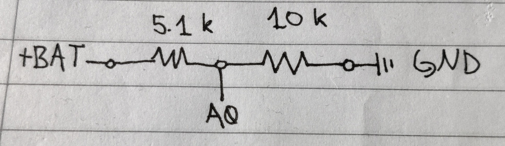

# SmartglassBatteryMonitor
A really simple battery level monitor for Raspberry Pi Zero W with an Arduino Pro Mini

### Programs:
* Python3 - autoshutdown.py - If the voltage is lower than the treshold, the Pi will be shut down
* Python3 - run.py - This is for testing if the serial connection works (NOTE: atm this won't work if autoshutdown.py is running!)
* Arduino - batteryMonitor.ino - Read battery voltage and send it back to the Raspberry Pi

### Requirements:
#### Python packages:
* pySerial (pip3 install pyserial)

#### Hardware:
* Arduino
* Raspberry Pi Zero W
* 5.1 k resistor
* 10 k resistor

#### Pinout (Between the Raspberry Pi Zero W & Arduino):
| Arduino pin   | Raspberry Pi Pin |
| ------------- | ------------- |
| VCC | 3V3 |
| TX  | UART0_TXD / GPIO14 |
| RX  | UART0_RXD / GPIO15 |
| VCC | 3V3 |
| GND | GND |

#### Pinout (Voltage Divider):
| Arduino pin   | Where you connect it |
| ------------- | ------------- |
| A0  | In the middle of the 5.1k and 10k resistors |
| GND | Other end of the 10k resistor |
| +BAT | Other end of the 5.1k resistor

#### How to use the autoshutdown.py:
* Make sure that the firmware works as expected with the `run.py`
* Go edit /etc/rc.local with `sudo nano /etc/rc.local`
* Add `sudo python3 /home/pi/Desktop/SmartglassBatteryMonitor/autoshutdown.py &` before the `exit 0` -line (NOTE: Make sure that the path is correct!)
* Reboot and it should work `sudo reboot now`
* And if you want to disable it, just remove the added line from the `/etc/rc.local`
